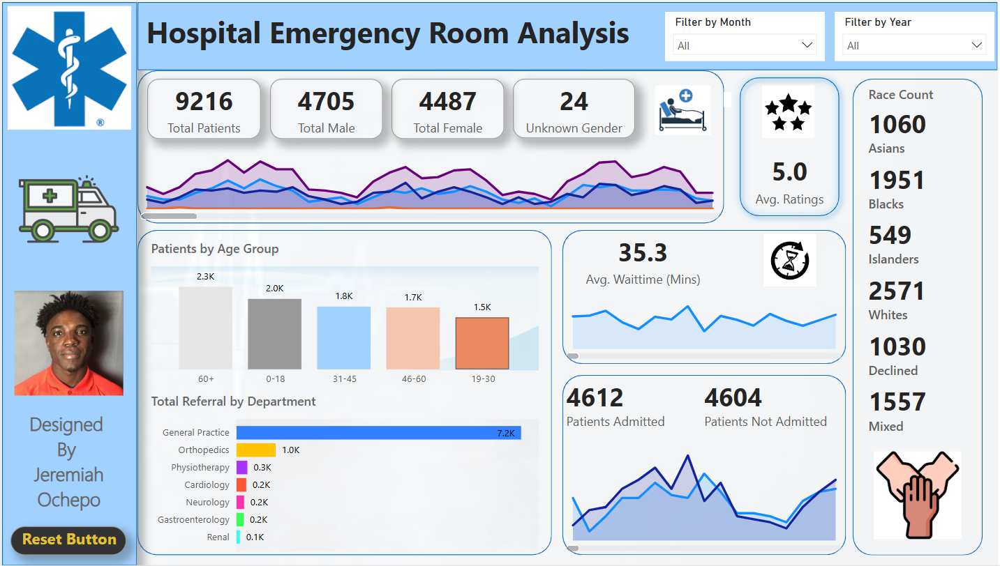

# Hospital Emergency Room Data Analysis

## Project Overview
This project analyzes **hospital emergency room (ER) visit data** to provide valuable insights into patient demographics, wait times, admission trends, satisfaction levels, and potential healthcare disparities. Using tools such as **Jupyter Notebook** and **Power BI**, we aim to explore key metrics that can help improve hospital efficiency and patient care.

## Table of Contents
- [Project Overview](#project-overview)
- [Project Objectives](#project-objectives)
- [Project Visuals](#project-visuals)
- [Project Key Insights](#project-key-insights)
- [Technologies Used](#technologies-used)
- [Contributors](#contributors)
- [License](#license)

## Project Objectives
- Analyze total ER visits based on **gender, race, and referral department**.
- Evaluate the **average wait time** per visit and its correlation with patient satisfaction.
- Identify trends in **admission rates by month** to anticipate hospital demand.
- Assess **patient satisfaction levels** across different demographics.
- Identify and mitigate potential **discrimination** in ER wait times or admission rates.
- Provide actionable insights to **optimize hospital operations** and improve service delivery.

## Project Visuals

### ER Data Table Preview

---

### Power BI Dashboard

#### Project Walkthrough Video
[Project Walkthrough Video](assets/power-bi-images/analysis/hospitap_emergency_analysis.mp4)

---

### Key Visualizations

- **Admission Rate by Month**
  

- **Age Distribution**
  

- **Age Group Satisfaction**
  

- **Gender Distribution**
  

- **Gender Satisfaction**
  

- **Race Satisfaction**
  

- **Referral Satisfaction**
  

## Project Key Insights

- **Seasonal Trends**: If admissions increase during specific months (such as flu season in winter), hospitals can adjust staffing levels and allocate additional resources to meet the demand.
  
- **Gender-Based Satisfaction**: By analyzing the relationship between admission rates and patient satisfaction across genders, the hospital can determine if there are any gender-related disparities in care quality.
  
- **Referral Patterns**: Identifying which departments refer the most patients to the ER helps uncover potential inefficiencies or gaps in outpatient care, suggesting areas for improvement.
  
- **Wait Time Optimization**: If wait times consistently exceed acceptable thresholds, this could indicate the need for improvements in triage processes, resource allocation, or staffing during peak hours.
  
- **Racial Disparities**: A disproportionate number of visits from certain racial groups may signal underlying healthcare access issues, suggesting the need for targeted interventions to address healthcare inequality.

## Technologies Used
- **Jupyter Notebook (Python, Pandas, Matplotlib, Seaborn)**: Data cleaning and visualization tools used to analyze and present the ER data.
- **Power BI**: Provides interactive dashboards and reports to visualize trends, patterns, and insights from the data.
- **HTML, CSS, JavaScript**: Used for the presentation and web interface of the project.

## Contributors
- **Your Name** – Data Analyst & Power BI Developer  
  [GitHub](https://github.com/yourusername) | [LinkedIn](https://linkedin.com/in/yourprofile)

## License
This project is licensed under the **MIT License**.

## Explore the Project
You can view the project repository and details here:  
[Project Repository](https://github.com/yourusername)

---

### Connect with Me
- [LinkedIn](https://www.linkedin.com/in/your-linkedin-profile/)
- [GitHub](https://github.com/your-github-profile)

### Designer
**Jeremiah Ochepo**
